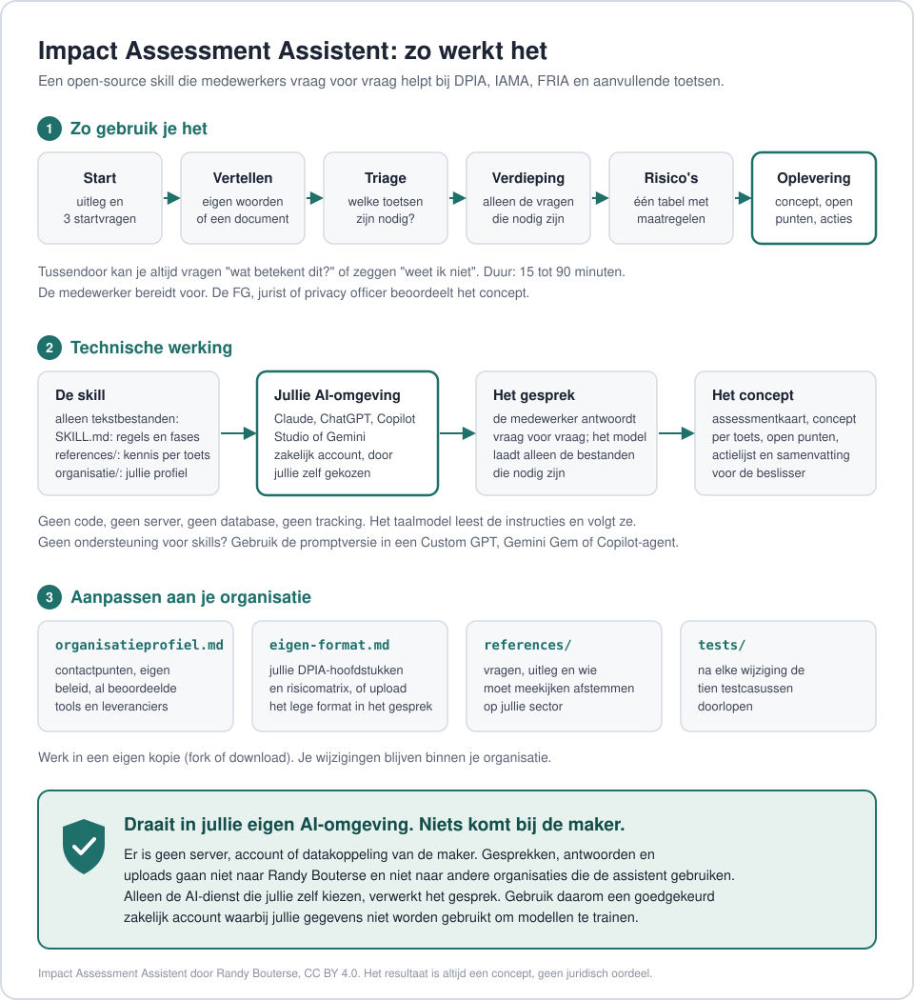

# Impact Assessment Assistent

Een open-source AI-assistent die medewerkers in gewone taal helpt bij het voorbereiden van impact assessments: de **DPIA**, de **IAMA** of **FRIA**, de **DTIA** en aanvullende toetsen voor de **AI Act**, **cloud en soevereiniteit**, **informatiebeveiliging** en de **ondernemingsraad**.

Gemaakt door **Randy Bouterse**. Gelicenseerd onder [CC BY 4.0](LICENSE).

> Bedoeld als hulpmiddel dat juridische en privacyafdelingen inzetten binnen hun eigen organisatie: medewerkers bereiden het assessment voor, de jurist, FG of privacy officer beoordeelt de uitvoer. De uitvoer is daarom altijd een concept. Zie de [disclaimer](DISCLAIMER.md).



## Privacy: draait in je eigen AI-omgeving

De assistent bestaat alleen uit tekstbestanden. Er is geen server, account, database of datakoppeling van de maker.

- Gesprekken, antwoorden en uploads gaan **niet naar de maker** en **niet naar andere organisaties** die de assistent gebruiken.
- Je aanpassingen, zoals het organisatieprofiel en een eigen format, blijven in je eigen kopie.
- Alleen de AI-dienst die je organisatie zelf kiest, verwerkt het gesprek. Gebruik daarom een goedgekeurd zakelijk account waarbij gegevens niet worden gebruikt om modellen te trainen.
- Feedback delen kan via een GitHub-issue, maar alleen als je dat zelf doet.

## Waarom

Juridische en privacyafdelingen worden vaak gezien als de partij die aan het eind van een project "nee" zegt. Medewerkers vinden een DPIA-formulier ingewikkeld, en juristen krijgen formulieren terug met vage antwoorden. Deze assistent helpt aan het begin van een project:

- Hij stelt **vraag voor vraag** de juiste vragen, in eenvoudige taal.
- Hij **legt begrippen uit** zodra iemand iets niet begrijpt, en gaat daarna verder met de vraag.
- Hij **vraagt door** bij vage of risicovolle antwoorden, zoals "anoniem", "met toestemming" of "dat regelt de leverancier".
- Hij bepaalt **welke assessments nodig zijn** en vraagt niets dubbel.
- Hij geeft **tips over wie moet meekijken**, zoals de CISO, architect, inkoop of ondernemingsraad.
- Hij kan **informatie uit documenten halen**, met een duidelijke waarschuwing om geen persoonsgegevens te uploaden.
- Hij levert een **concept** op in het format van de organisatie, met open punten, een actielijst en een samenvatting voor de beslisser.

## Hoe het werkt

1. **Start.** Korte uitleg en uploadwaarschuwing, daarna drie vragen: het type organisatie, de rol van de gebruiker en wie het concept beoordeelt, en of er een eigen format is.
2. **Vertel het zelf.** De gebruiker beschrijft het project of uploadt een document.
3. **Triage.** Gerichte vragen leiden tot een assessmentkaart (wat is nodig, waarom en vanaf wanneer) en een tipsblok (wie moet nu al meekijken).
4. **Verdieping.** Eerst een gedeelde basis, dan alleen de modules die nodig zijn. Een koppeltabel zorgt dat niets dubbel wordt gevraagd.
5. **Risico's en maatregelen.** Samen risico's benoemen als gevolg voor mensen, met kans, ernst, maatregelen en restrisico.
6. **Oplevering.** Concepten, open punten, actielijst en een samenvatting van één pagina.

## Wat erin zit

| Onderdeel | Gebaseerd op |
|---|---|
| Triage | AVG artikel 35, EDPB-richtsnoeren (WP248), lijst van de Autoriteit Persoonsgegevens, Model DPIA Rijksdienst |
| DPIA | De 17 onderdelen van het Model DPIA Rijksdienst (augustus 2026) |
| IAMA en FRIA | IAMA versie 2 (februari 2026) en artikel 27 AI Act |
| AI Act | Definitie, verboden toepassingen, hoog risico, rollen, plichten van de gebruiksverantwoordelijke, transparantie en tijdlijn, inclusief de Digitale omnibus inzake AI |
| DTIA | Doorgifte buiten de EER, los van buitenlandse zeggenschap |
| Cloud en soevereiniteit | Herziening rijksbreed cloudbeleid (3 juli 2026) |
| Informatiebeveiliging | BIV-classificatie, BIO2, Cyberbeveiligingswet |
| Ondernemingsraad | Instemmings- en adviesrecht (WOR) |
| Voorbeelden | Openbare zaken: Copilot-DPIA (SLM Rijk en SURF), DUO, Slimme Check Amsterdam, CNIL en Amazon France Logistique |

## Installatie

De assistent volgt de open standaard **Agent Skills** (een map met een `SKILL.md`-bestand). Menu's van platforms veranderen regelmatig; controleer bij twijfel de documentatie van je platform.

**Kant-en-klare zip:** download `impact-assessment-assistent.zip` bij de nieuwste [release](https://github.com/RandyBouterse/impact-assessment-assistent/releases/latest). `SKILL.md` staat daarin al in de bovenste laag, zoals de platforms verwachten.

**Zelf een zip maken** (bijvoorbeeld na eigen aanpassingen): zip de inhoud van de repository, niet de map zelf, zodat `SKILL.md` in de bovenste laag staat.

| Platform | Hoe | Opmerking |
|---|---|---|
| **Claude** (claude.ai) | Instellingen, onderdeel Skills, zip uploaden | Betaalde abonnementen |
| **Claude Code** | `git clone https://github.com/RandyBouterse/impact-assessment-assistent.git ~/.claude/skills/impact-assessment-assistent`, of dezelfde map in `.claude/skills/` van je project | |
| **ChatGPT** | Skills, Create, Upload from your computer | Business, Enterprise, Edu en Healthcare; beheerders bepalen of uploaden is toegestaan |
| **Microsoft Copilot Studio** | Skill toevoegen via upload van de zip | Preview sinds juli 2026; gedrag kan nog veranderen |
| **Gemini** | Skill uploaden als map of zip | Stand oktober 2026: alleen persoonlijke Google-accounts, Workspace nog niet |
| **GitHub Copilot, Cursor, Codex** | Map in de skills-map van het hulpmiddel | Vooral voor ontwikkelaars |

**Geen ondersteuning voor skills?** Gebruik de [promptversie](prompt-versie/systeemprompt.md) in een Custom GPT, Gemini Gem of Copilot-agent, en upload de bestanden uit `references/` als kennisbestanden.

**Let op:** gebruik de assistent alleen in een AI-omgeving die je organisatie heeft goedgekeurd, waarbij gegevens niet worden gebruikt om modellen te trainen.

## Aanpassen aan je organisatie

- Vul [`organisatie/organisatieprofiel.md`](organisatie/organisatieprofiel.md) in met contactpunten, eigen beleid en al beoordeelde tools.
- Gebruik je een eigen DPIA-format? Vul [`organisatie/eigen-format.md`](organisatie/eigen-format.md) in, of laat gebruikers het lege format uploaden tijdens het gesprek.

## Opbouw

```
impact-assessment-assistent/
  SKILL.md                     gespreksregels, fases en werkwijze
  references/
    triage.md                  triagevragen, beslisregels, assessmentkaart
    dpia.md                    DPIA per onderdeel, met voorbeelden
    iama-fria.md               IAMA en FRIA per onderdeel
    aanvullende-toetsen.md     AI Act, transparantie, DTIA, cloud, beveiliging, OR
    crosswalk.md               koppeltabel DPIA, IAMA, FRIA
    doorvragen.md              signalen en doorvraagregels
    uitleg-begrippen.md        begrippen in gewone taal
    stakeholders.md            wie moet wanneer meekijken
    uploads.md                 veilig omgaan met documenten
    uitvoer.md                 formats voor de oplevering
  organisatie/                 in te vullen per organisatie
  prompt-versie/               voor platforms zonder skills
  tests/testcasussen.md        tien casussen met verwachte uitkomst
  docs/zo-werkt-het.svg        afbeelding: gebruik, werking, aanpassen, privacy
  scripts/controleer.py        controles bij elke wijziging
  .github/                     automatische controle, release-zip, issueformulieren
```

## Testen

`python3 scripts/controleer.py` controleert of de promptversie onder de 8.000 tekens blijft, of elk referentiebestand een controledatum heeft en of de verwijzingen in `SKILL.md` kloppen. GitHub draait deze controle automatisch bij elke pull request.

[`tests/testcasussen.md`](tests/testcasussen.md) bevat tien casussen, van een gemeentelijke AI-score tot een eenvoudige roosterspreadsheet, met de verwachte assessmentkaart en het gedrag dat je moet zien. Gebruik ze na elke wijziging en in elk nieuw platform.

## Bronnen

- [AVG, Verordening (EU) 2016/679](https://eur-lex.europa.eu/eli/reg/2016/679/oj/nld)
- [AI Act, Verordening (EU) 2024/1689](https://eur-lex.europa.eu/eli/reg/2024/1689/oj/nld), zoals gewijzigd door de [Digitale omnibus inzake AI, Verordening (EU) 2026/1744](https://eur-lex.europa.eu/eli/reg/2026/1744/oj/nld)
- [Model DPIA Rijksdienst, augustus 2026](https://www.kcbr.nl/sites/default/files/2026-08/088_T1_20260818%20Model%20DPIA%20Rijksdienst.pdf) (Kenniscentrum Bedrijfsvoering Rijk)
- [Impact Assessment Mensenrechten en Algoritmes, versie februari 2026](https://www.rijksoverheid.nl/documenten/rapporten/2026/02/16/impact-assessment-mensenrechten-en-algoritmes)
- [Herziening rijksbreed cloudbeleid 2026](https://www.tweedekamer.nl/downloads/document?id=2026D35295)
- EDPB-richtsnoeren over DPIA's (WP248) en de lijst van de Autoriteit Persoonsgegevens
- BIO2 (september 2025), Cyberbeveiligingswet (van kracht sinds 15 augustus 2026), Wet op de ondernemingsraden

Elk referentiebestand vermeldt wanneer en tegen welke bronnen het voor het laatst inhoudelijk is gecontroleerd.

## Bijdragen

Verbeteringen zijn welkom, vooral van FG's, privacyjuristen, CISO's en mensen die de assistent in de praktijk gebruiken. Zie je een juridische fout of een verouderde regel? [Open een issue](https://github.com/RandyBouterse/impact-assessment-assistent/issues/new/choose); het formulier vraagt om:

- wat er mis ging of beter kan
- indien mogelijk een (geanonimiseerd) voorbeeld van het gesprek
- bij juridische wijzigingen: een link naar de bron

Deel nooit persoonsgegevens of vertrouwelijke informatie in een issue.

## Licentie

[CC BY 4.0](LICENSE). Je mag de assistent gebruiken, aanpassen en delen, ook commercieel, met vermelding van de maker: "Impact Assessment Assistent door Randy Bouterse, CC BY 4.0".
